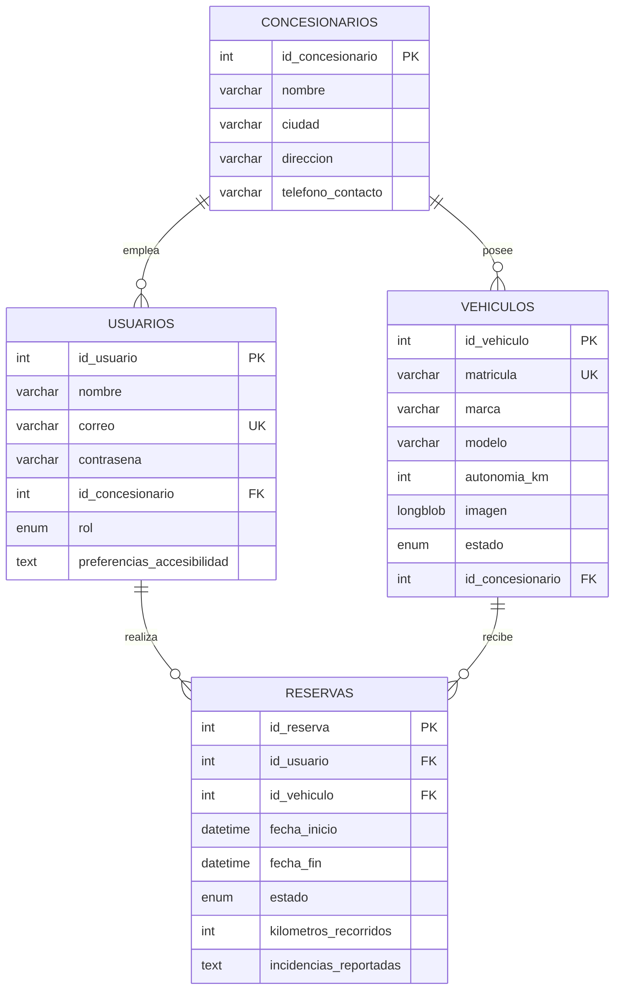

# ⚡ Flota Eléctrica

**Plataforma web para la gestión de flotas de vehículos eléctricos en red de concesionarios.**

Aplicación completa con autenticación, control de roles, sistema de reservas con detección de conflictos horarios, panel de administración con estadísticas y un módulo de accesibilidad configurable.


---

## Qué resuelve

Una empresa con varios concesionarios necesita que sus empleados reserven vehículos eléctricos de la flota sin pisarse unos a otros, y que los administradores controlen el inventario y midan el uso real.

La aplicación cubre ese flujo completo: un empleado entra, ve sólo los vehículos de su concesionario, reserva por franja horaria, y al devolver el vehículo registra kilómetros e incidencias. El administrador gestiona el inventario, da de alta concesionarios y usuarios, y consulta métricas agregadas de uso.

---

## Funcionalidades

### Autenticación y roles

- Registro con hash de contraseñas mediante **bcrypt**.
- Política de contraseñas validada en servidor: mínimo 8 caracteres, al menos una mayúscula y un dígito.
- Sesiones persistentes con `express-session` y caducidad a 24 horas.
- Dos roles con permisos diferenciados:

| | Empleado | Administrador |
|---|---|---|
| Reservar vehículos | ✅ Sólo de su concesionario | ❌ Bloqueado por diseño |
| Gestionar sus reservas | ✅ | — |
| CRUD de vehículos | ❌ | ✅ |
| CRUD de concesionarios | ❌ | ✅ |
| Gestión de usuarios | ❌ | ✅ |
| Estadísticas de flota | ❌ | ✅ |
| Carga masiva de datos | ❌ | ✅ |

Cada ruta protegida verifica sesión y rol antes de ejecutar nada, devolviendo `401` o `403` según el caso.

### Sistema de reservas

El núcleo de la aplicación. Antes de confirmar una reserva se validan cinco condiciones encadenadas:

1. El usuario tiene sesión activa y no es administrador.
2. Todos los campos de fecha y hora están presentes.
3. La fecha de fin es posterior a la de inicio.
4. La fecha de inicio no es anterior a hoy.
5. El vehículo existe, pertenece al concesionario del empleado y no está en mantenimiento.

Superado eso, se comprueba el **solapamiento temporal** contra las reservas activas del vehículo:

```sql
SELECT * FROM reservas
WHERE id_vehiculo = ?
  AND estado = 'activa'
  AND fecha_inicio < ?   -- fecha_fin de la nueva reserva
  AND fecha_fin > ?      -- fecha_inicio de la nueva reserva
```

Esta condición detecta cualquier intersección entre dos intervalos, incluidos los casos en que una reserva contiene íntegramente a la otra. Si devuelve alguna fila, la reserva se rechaza.

El ciclo de vida de una reserva es `activa → completada` o `activa → cancelada`. Al finalizar, el empleado registra kilómetros recorridos e incidencias, que alimentan las estadísticas.

### Panel de administración

- **Vehículos** — alta, modificación y baja, con subida de imagen vía `multer` almacenada como `LONGBLOB`.
- **Concesionarios** — alta y baja, con integridad referencial gestionada por claves foráneas.
- **Usuarios** — consulta y modificación, incluida la reasignación de concesionario y rol.
- **Estadísticas** — agregados calculados en SQL: total de reservas, reservas activas, vehículos por estado, kilómetros acumulados, ranking de los 5 vehículos más usados y de los 5 usuarios más activos, y reservas agrupadas por concesionario.

### Carga de datos

Dos mecanismos complementarios:

- **Bootstrap automático** — si la base de datos está vacía, la aplicación redirige a una pantalla pública de carga inicial que puebla concesionarios, vehículos y usuarios desde `datos_iniciales.json`. Evita el arranque en frío con la base a cero.
- **Importación masiva** — el administrador sube un JSON y obtiene una **previsualización** de lo que se va a insertar antes de confirmar. La escritura sólo ocurre tras la validación explícita.

### Accesibilidad

Módulo transversal presente en todas las vistas, con preferencias persistidas en sesión de servidor (no en `localStorage`), de modo que acompañan al usuario entre dispositivos:

- **Paleta de alto contraste** para baja visión.
- **Paleta adaptada a daltonismo**.
- **Tamaño de fuente ajustable** entre 12 y 24 px.
- **Navegación por teclado** activable.

Las preferencias se guardan y recuperan mediante dos endpoints dedicados (`POST /accesibilidad/guardar`, `GET /accesibilidad/obtener`) consumidos por `fetch` desde el cliente.

---

## Modelo de datos



Las relaciones aplican integridad referencial diferenciada según el caso: borrar un concesionario deja a sus usuarios y vehículos sin asignar (`ON DELETE SET NULL`), mientras que borrar un usuario o un vehículo arrastra sus reservas (`ON DELETE CASCADE`).

---

## Stack

| Capa | Tecnología |
|---|---|
| Servidor | Node.js + Express 4 |
| Vistas | EJS (renderizado en servidor) |
| Base de datos | MySQL con pool de 10 conexiones |
| Autenticación | bcrypt + express-session |
| Subida de ficheros | multer |
| Estilos | Bootstrap 5 + CSS propio |
| Logging | morgan |

---

## Instalación

### Requisitos

- Node.js 16 o superior
- MySQL 5.7 o superior

### Puesta en marcha

```bash
# 1. Clonar
git clone https://github.com/rodrigobanos/flota-vehiculos-electricos.git
cd flota-vehiculos-electricos/flota_vehiculos

# 2. Instalar dependencias
npm install

# 3. Crear la base de datos
mysql -u root -p -e "CREATE DATABASE flota_vehiculos;"
mysql -u root -p flota_vehiculos < ../scriptsql.sql

# 4. Configurar el entorno
cp .env.example .env      # y editar con tus credenciales

# 5. Arrancar
npm start
```

La aplicación queda disponible en **http://localhost:3000**.

En el primer arranque, al detectar la base de datos vacía, serás redirigido automáticamente a la pantalla de carga inicial para poblarla con los datos de ejemplo.

### Variables de entorno

| Variable | Descripción | Por defecto |
|---|---|---|
| `DB_HOST` | Host de MySQL | `localhost` |
| `DB_USER` | Usuario de MySQL | `root` |
| `DB_PASSWORD` | Contraseña de MySQL | *(vacía)* |
| `DB_NAME` | Nombre de la base de datos | `flota_vehiculos` |
| `SESSION_SECRET` | Secreto de firma de sesión | — |
| `PORT` | Puerto del servidor | `3000` |

---

## Estructura del proyecto

```
flota_vehiculos/
├── app.js                  Configuración de Express, middlewares y sesión
├── bin/www                 Punto de entrada y arranque del servidor HTTP
├── routes/
│   └── index.js            Rutas y lógica de negocio
├── views/                  Plantillas EJS
│   ├── index.ejs           Login y registro
│   ├── dashboard.ejs       Panel principal
│   ├── vehiculos.ejs       Catálogo y formulario de reserva
│   ├── mis_reservas.ejs    Reservas del usuario
│   ├── perfil.ejs          Perfil y preferencias
│   ├── carga_inicial.ejs   Bootstrap de base de datos vacía
│   └── admin_*.ejs         Vistas del panel de administración
├── public/
│   ├── javascripts/main.JS Accesibilidad y llamadas asíncronas
│   ├── stylesheets/        Bootstrap y estilos propios
│   └── images/             Logotipo y fotografías de vehículos
├── datos_iniciales.json    Conjunto de datos de ejemplo
└── scriptsql.sql           Esquema de la base de datos
```

---

## Decisiones técnicas

**Consultas parametrizadas en todo el proyecto.** Todas las interacciones con la base de datos usan placeholders `?` en lugar de concatenación de cadenas, lo que elimina la superficie de inyección SQL.

**Preferencias de accesibilidad en sesión de servidor.** Guardarlas en cliente habría sido más simple, pero se pierden al cambiar de navegador o dispositivo. Persistirlas en sesión, con la columna `preferencias_accesibilidad` como respaldo en base de datos, mantiene la configuración del usuario allá donde entre.

**Pool de conexiones en lugar de conexión única.** Con diez conexiones reutilizables se evita el coste de abrir y cerrar en cada petición, y se soporta concurrencia real entre empleados reservando a la vez.

**Previsualización obligatoria antes de la importación masiva.** Un JSON mal formado podría corromper el inventario completo. Separar la previsualización de la ejecución convierte un error potencialmente destructivo en algo reversible antes de confirmar.

**Administradores excluidos de reservar.** Es una restricción deliberada, no una omisión: separa la gestión del uso y evita que quien controla el inventario compita por él.

---

## Posibles mejoras

- [ ] Migrar de callbacks anidados a `async/await` con `mysql2/promise`.
- [ ] Extraer la lógica de negocio de `routes/index.js` a una capa de controladores y servicios.
- [ ] Almacenar las imágenes en sistema de ficheros o CDN en lugar de `LONGBLOB`.
- [ ] Tests de integración sobre el motor de solapamiento de reservas.
- [ ] Protección CSRF en los formularios.
- [ ] Paginación en los listados del panel de administración.

---

## Autores

Proyecto académico desarrollado en equipo para el Grado en Ingeniería del Software de la Universidad Complutense de Madrid.

**Rodrigo Baños Fernández** — [LinkedIn](https://linkedin.com/in/rodrigobanos)
